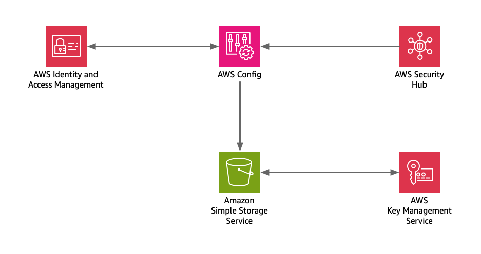

# Security Hub
The CloudFormation templates in this solution were developed during a series of Twitch streams. They were tested during
the stream, but come as is, and without any support. 

Before deploying any resources in your account be sure to understand what you are deploying, and how it may affect your 
environment. Before deploying anything in your AWS account, be sure to understand how the newly created resources 
will affect your bill.

The Twitch records are available on our [YouTube channel](https://www.youtube.com/@brettg98).

You can watch us develop CloudFormation live on our [Twitch channel](https://twitch.tv/curiousorbit). We broadcast on 
Tuesday evenings at 7PM ET.

## Description
The templates in this solution allow you to quickly deploy AWS Security Hub in a single AWS region. Once deployed Security
Hub will generate findings and identify potential security improvements.

Below is a reference diagram that outlines the solution and the AWS services that will be deployed.

## Notes
* This solution will deploy IAM resources. Before deploying any new IAM resources, it's important to understand how the 
new resources may affect the overall security of your account. Please carefully review the IAM CloudFormation template before
deploying in your account.
* Each of the templates included in this solution contains multiple parameters. While most of the parameters contain default 
values you should review each parameter prior to deployment to ensure the values are appropriate.

## Resources
* [AWS Security Hub](https://aws.amazon.com/security-hub/)

## Deployment Instructions
The templates in this solution use cross-stack references, therefore, deployment order is important - outputs from
one template, become inputs for another. Deploy the stacks in the following order:

1. kms.yml
2. s3.yml
3. iam.yml
4. config.yml
5. hub.yml
